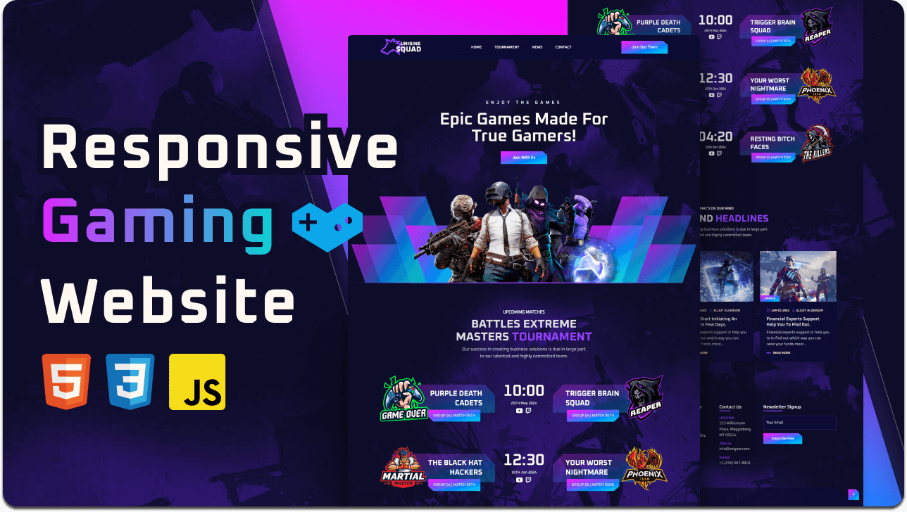

<div align="center">

  <h2 align="center">Masiv Gaming - HTML Gaming Website</h2>

  Masiv Gaming is a fully responsive HTML Games gaming website, <br />Responsive for all devices, build using HTML, CSS, and JavaScript.

  <a href="https://masivgaming.info.gf/"><strong>➥ Live Demo</strong></a>

</div>

<br />

### Demo Screeshots



### Prerequisites

Before you begin, ensure you have met the following requirements:

* [Git](https://git-scm.com/downloads "Download Git") must be installed on your operating system.

### Run Locally

To run **Masiv Gaming** locally, run this command on your git bash:

Linux and macOS:

```bash
sudo git clone https://github.com/jainharsh8506/Masiv-Gaming.git
```

Windows:

```bash
git clone https://github.com/jainharsh8506/Masiv-Gaming.git
```
